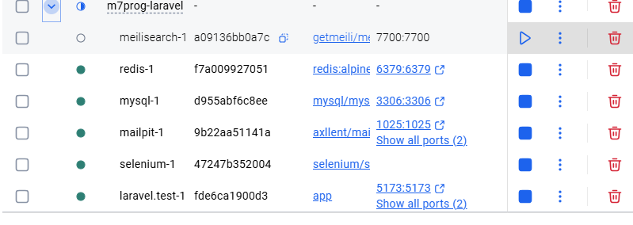
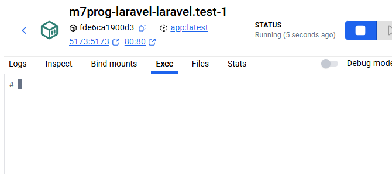
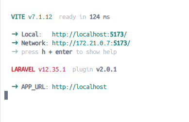
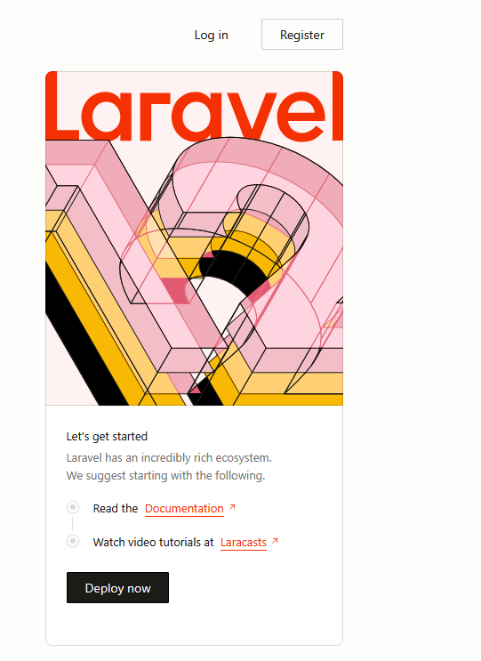
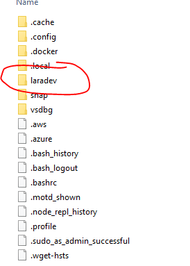

## wsl setup

- open je wsl (wij gebruiken Ubuntu als distro)
    `wsl -d Ubuntu`
    - je ziet nu dat je in een mnt directory zit:
        > 
- ga naar je home 
    - `cd ~`
- maak een directory voor je laravel development
    - `mkdir laradev`
- ga naar de directory
    - `cd laradev`

> 
## laravel project opzetten

- maak een nieuw project (type of kopieer):
    - `curl -s https://laravel.build/m7prog-laravel | bash`

    > HINT m7prog-laravel kan je veranderen als je andere projecten start
- als het goed is heb je een wachtwoord voor je android (zo niet zie de `wsl change pw.md` )
    - type die zodra die [sudo] password... vraagt
    > 

## sail up

- ga naar je project dir:
    > 
    > dat is nu m7prog-laravel

- type nu `vendor/bin/sail up`

- nu zie je:

    > 
## controle

- nu draait je docker, check of je dit hebt:
    > 

## breeze npm etc

- open je exec van je laravel docker container:
    > 
    
- installeer breeze:
- composer require laravel/breeze --dev
    - `php artisan breeze:install`
    - `php artisan migrate`

- installeer npm:
    - `npm install`
- test:
    - `npm run dev`
    - je ziet:
    > 
    
- open je browser je ziet nu laravel met breeze
    > 

## Files in visual studio code

- al onze files staan nu in het linux file system van wsl hoe komen we daar bij?
    - open explorer (van windows)
        - in de adres balk type je:
            - `\\wsl.localhost\Ubuntu\home\android`

        - daar staat onze directory
            > 
- open die directory in visual studio code
- nu kan je beginnen met coderen!