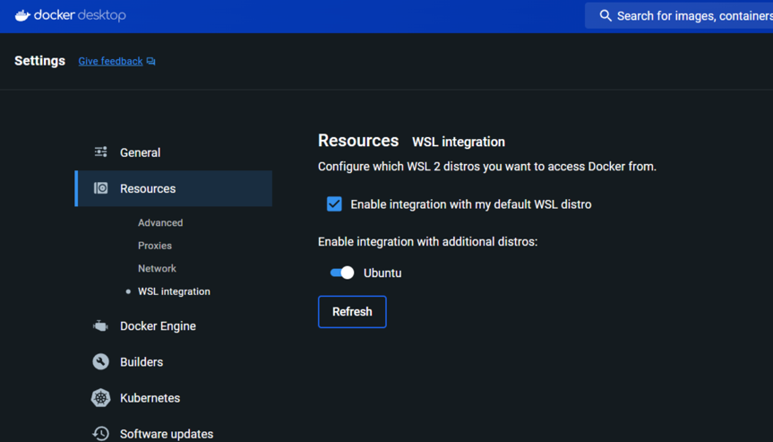
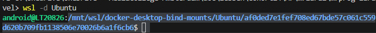
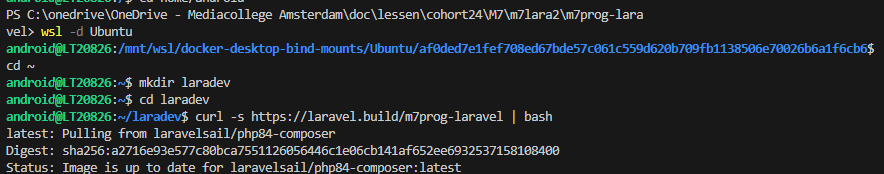

## Laravel project starten
{: .text-green-100 .fs-6 }

We gaan Laravel installeren in een Docker omgeving.  
Deze omgeving gaan wij tijdens deze gehele module gebruiken.

---
### 1- Laravel project initialiseren
1- Maak een nieuwe repository aan in [GitHub](http://github.com/) voor **m7prog-laravel**  
2- Navigeer op je computer naar de folder waar je project straks komt te staan.  
3- Wij werken nu volgens de setup van [laravel.com](https://laravel.com/docs/11.x)  
4- Start eerst [Docker Desktop](https://www.docker.com/products/docker-desktop/)  
Je kunt Laravel installeren op **twee** manieren, met een nieuwe docker installatie via **curl** of via **composer**.  

### 2- WSL instellen, _Windows only_.
**Let op:** Op Windows moet je een paar extra stappen doorlopen, deze hoef je maar één keer uit te voeren, heb je Laravel al een keer opgezet dan kun je deze stap overslaan.  
Controleer of je WSL versie 2 hebt, door het volgende commando uit te voeren in je Windows Prompt:   
``` 
wsl -v
```
Als je hier versie 2.x ziet staan dan kun je deze stap dus overslaan.  

Hier vind je de laatste documentatie: [laravel.com - sail-on-windows](https://laravel.com/docs/11.x#sail-on-windows)
Op Windows moet je gebruik maken van WSL. Dit is een Linux laag die binnen Windows gaat draaien.  
1. Zorg ervoor dat je wsl geïnstalleerd hebt [Windows documentatie](https://learn.microsoft.com/en-us/windows/wsl/install)  
    Dit doe je door het volgende commando uit te voeren in command prompt:  
``` wsl --install ```  
    Het kan zijn dat je een user moet aanmaken, hiervoor moet je een naam ingeven **zonder** _kapitalen_ en _spaties_.  
    Bij het invullen van het wachtwoord klopt het dat je **niets** ziet.  
2. Open nu Docker Desktop.  
   Ga naar `instellingen` en dan `resources` en zet onder het `WSL integration` tabje `Ubuntu` aan, zie afbeelding.  
   
3. Herstart nu je computer. _( Ja, echt waar )_ 
4. Open nu de project folder waar je straks gaat werken in jouw editor, zoals **Visual Studio Code** of **PhpStorm**  
5. In je editor open je de terminal en selecteer daar de 'wsl' modus.  

---
### 3- WSL configuratie, _Windows only_.
Voor Windows gebruikers is het handig om de volgende stappen te doorlopen zodat je project lekker snel blijft.  
Open je **wsl** in je command prompt _(wij gebruiken Ubuntu als distro)_  
```shell
wsl -d Ubuntu
```
Je ziet nu dat je in een mount _(mnt)_ directory zit:    


Ga naar je home  
```shell
cd ~
```

Maak een directory voor je laravel development, hier ga je straks de code in plaatsen.
```shell
mkdir laradev
```
Ga nu naar de directory die je hebt aangemaakt:  
```shell
cd laradev
```



### 4- Installatie via Curl
Navigeer naar je project folder en voer het volgende commando uit in de terminal om je project te initialiseren:
```curl -s "https://laravel.build/m7prog-laravel" | bash```
Zo initialiseer je een nieuw laravel project in de folder **m7prog-laravel**.  
Wil je een ander project aanmaken pas dan het laatste gedeelte van de url aan, bv voor project SCHOOLFRUIT:  
```curl -s "https://laravel.build/SCHOOLFRUIT" | bash```  

# Het kan zijn dat je een error tegen komt over een ```cmdlet invoke-expression at command pipeline position 1```
{: .text-red-100 .fs-3 }
Gebruik in dat geval de **wsl terminal**, deze vind je onder het ```+``` teken rechtsboven.
{: .text-red-100 .fs-3 }

Navigeer nu naar je project folder, bv m7prog-laravel:  
```rm -r m7prog-laravel```  
Je kunt nu Laravel starten door gebruik te maken via Sail  
```./vendor/bin/sail up -d```  
Wil je niet elke keer dit hele pad moeten opgeven dan kun je een alias maken:    
```alias sail='bash vendor/bin/sail'```  
Vanaf nu kun je bijvoorbeeld dit commando uitvoeren voor een migratie:  
```sail artisan migrate```  

---
### 4- Migratie
Voordat je het framework kunt gebruiken moeten er misschien een aantal database migraties uitgevoerd worden, gebruik hiervoor het volgende commando:  
```shell
./vendor/bin/sail artisan migrate
```
Dit doe je in de ```terminal``` op mac, of in de WSL op windows.  
Lukt dit niet, dan kun je dit ook in de terminal van de ```laravel-test``` instance het volgende commando uitvoeren:
```shell
php artisan migrate
```
De terminal kun je vinden door op de 3 puntjes achter de instance te klikken en dan ```terminal``` te selecteren.

---
### 4- Controle
Als het goed is heb je nu een nieuw Laravel project waar je in kunt gaan werken.

- Zorg ervoor dat je een git repo gekoppeld hebt aan dit project., voeg dit eventueel toe via `git init`.  
- Je kunt de url terug vinden door in docker desktop te bekijken welke docker container er aan staat.  
  Klik dan op de port naast de `NGINX` of `Laravel-test` container om je project in de browser te openen, bijvoorbeeld [http://localhost:80](http://localhost:80) 
- Wil je een `php artisan` commando uitvoeren dan moet je gebruik maken van de `php` of `Laravel-test` container in Docker.

---
### Files in visual studio code
Op **Mac** open je nu de finder met dit commando:  
```shell
open .
```
Open deze folder in **visual studio code** en begin met coderen.

Op **Windows** open je deze folder door in de File Explorer ( verkenner ) dit adres in de adresbalk te tikken.  
_Al onze files staan namelijk in het linux file system van wsl._
```shell
\\wsl.localhost\Ubuntu\home\`
```
Daar staat een folder met jouw Ubuntu gebruikersnaam, open die.  
Vervolgens zie je een `Laradev` folder, ook die open je.  
Als het goed is zie je nu jouw project folder staan, open deze in **visual studio code**  
Nu kan je beginnen met coderen!


---



---
### Volgende stap:
{: .text-green-100 .fs-4 }  
[Configureer je Laravel project](laravel-config)
