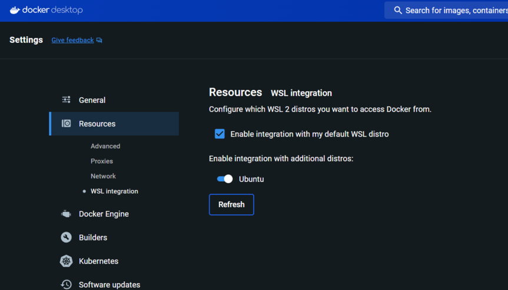

## Laravel project starten
{: .text-green-100 .fs-6 }

We gaan Laravel installeren in een Docker omgeving.  
Deze omgeving gaan wij tijdens deze gehele module gebruiken.

---
### 1- Laravel project initialiseren
1- Maak een nieuwe repository aan in [GitHub](http://github.com/) voor **m7prog-laravel**  
2- Navigeer op je computer naar de folder waar je project straks komt te staan.  
3- Wij werken nu volgens de setup van [laravel.com](https://laravel.com/docs/11.x)  
4- Start eerst [Docker Desktop](https://www.docker.com/products/docker-desktop/)  
Je kunt Laravel installeren op **twee** manieren, met een nieuwe docker installatie via **curl** of via **composer**.  

### Windows gebruikers
**Let op:** Op Windows moet je een paar extra stappen doorlopen.  
Hier vind je de laatste documentatie: [laravel.com - sail-on-windows](https://laravel.com/docs/11.x#sail-on-windows)
Op Windows moet je gebruik maken van WSL. Dit is een Linux laag die binnen Windows gaat draaien.  
1. Zorg ervoor dat je wsl geïnstalleerd hebt [Windows documentatie](https://learn.microsoft.com/en-us/windows/wsl/install)  
    Dit doe je door het volgende commando uit te voeren in command prompt:  
``` wsl --install ```  
    Het kan zijn dat je een user moet aanmaken, hiervoor moet je een naam ingeven **zonder** _kapitalen_ en _spaties_.  
    Bij het invullen van het wachtwoord klopt het dat je **niets** ziet.  
2. Open nu Docker Desktop.  
   Ga naar `instellingen` en dan `resources` en zet onder het `WSL integration` tabje `Ubuntu` aan, zie afbeelding.  
   
3. Herstart nu je computer. _( Ja, echt waar )_ 
4. Open nu de project folder waar je straks gaat werken in jouw editor, zoals **Visual Studio Code** of **PhpStorm**  
5. In je editor open je de terminal en selecteer daar de 'wsl' modus.  

### 2- Installatie via Curl
Navigeer naar je project folder en voer het volgende commando uit in de terminal. Zo initialiseer je een nieuw laravel project in de folder **m7prog-laravel**:  
```curl -s "https://laravel.build/m7prog-laravel" | bash```  

# Het kan zijn dat je een error tegen komt over een ```cmdlet invoke-expression at command pipeline position 1```
{: .text-red-100 .fs-3 }
Gebruik in dat geval de **wsl terminal**, deze vind je onder het ```+``` teken rechtsboven.
{: .text-red-100 .fs-3 } 

Verplaats nu de gegevens uit de nieuwe **m7prog-laravel** folder naar de huidige folder:  
```mv m7prog-laravel/* ./```
Verwijder vervolgens de m7prog-laravel folder:
```rm -r m7prog-laravel```
Je kunt nu Laravel starten door gebruik te maken via Sail  
```./vendor/bin/sail up```
Wil je niet elke keer dit hele pad moeten opgeven dan kun je een alias maken:  
```alias sail='bash vendor/bin/sail'```  
Vanaf nu kun je bijvoorbeeld dit commando uitvoeren voor een migratie:  
```sail artisan migratea```

---
### 3- Migratie
Voordat je het framework kunt gebruiken moeten er misschien een aantal database migraties uitgevoerd worden, gebruik hiervoor het volgende commando:  
```shell
./vendor/bin/sail artisan migrate
```
Dit doe je in de ```terminal``` op mac, of in de WSL op windows.  
Lukt dit niet, dan kun je dit ook in de terminal van de ```laravel-test``` instance het volgende commando uitvoeren:
```shell
php artisan migrate
```
De terminal kun je vinden door op de 3 puntjes achter de instance te klikken en dan ```terminal``` te selecteren.

---
### 4- Controle
Als het goed is heb je nu een nieuw Laravel project waar je in kunt gaan werken.

- Zorg ervoor dat je een git repo gekoppeld hebt aan dit project.  
- Je kunt de url terug vinden door in docker desktop te bekijken welke docker container er aan staat.  
  Klik dan op de port naast de `NGINX` of `Laravel-test` container om je project in de browser te openen, bijvoorbeeld [http://localhost:80](http://localhost:80) 
- Wil je een `php artisan` commando uitvoeren dan moet je gebruik maken van de `php` of `Laravel-test` container in Docker.


---



---
### Volgende stap:
{: .text-green-100 .fs-4 }  
[Configureer je Laravel project](laravel-config)
